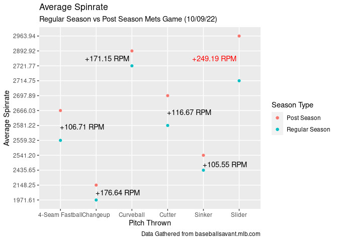
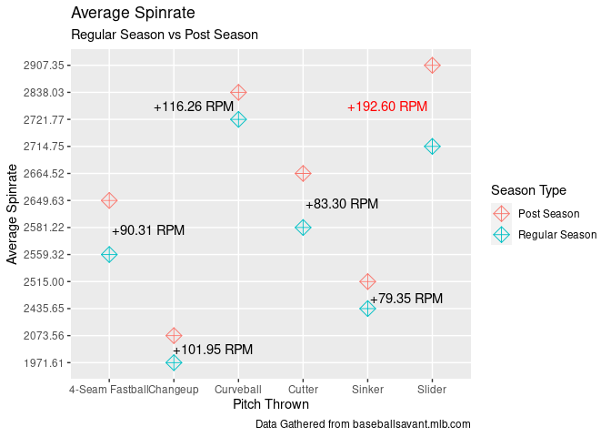

Joe Musgrove Pitching Data
================
Cory Gargan
2022-12-08

# Taking a Closer Look at Joe Musgrove’s Spinrate

#### Did he use a foreign substance to increase spinrate, and if so, did it have a significant impact on his Post Season?

During the 2022 MLB Playoffs vs. the NY Mets, the Umpires were sent by
Mets skipper Buck Showalter to check Pitcher Joe Musgrove for the use of
a foreign substance.

The Umpires quick check of the pitcher’s ears resulted in a dismissal of
the allegation, but was that truly the case?

Note: To create my environment I loaded the following libraries:

- `tidyverse`  
- `skimr`  
- `janitor`  
- `gridExtra`

Along with the dataset:

- All Data was collected from [MLB Baseball
  Savant](https://baseballsavant.mlb.com/statcast_search)
- `MLB_Musgrove-Joe_Reg-Post-Season_Pitch-Data`
  - This dataset can be found in the github project folder

``` r
library(tidyverse)  
library(skimr)
library(janitor)
library(gridExtra)
spinrate <- read_csv("~/Documents/Data-Analysis/Github/Portfolio-Projects/05-Joe-Musgrove-Spinrate-Data/MLB_Musgrove-Joe_Reg-Post-Season_Pitch-Data.csv")
```

### Average Spinrate, Regular Season vs Post Season

When looking at the Data there is a very clear increase in Post Season
Spinrate

- 4-Seam Fastball +90.31 RPM  
- Changup +101.95 RPM  
- Curveball +116.26 RPM  
- Cutter +83.30 RPM  
- Sinker +79.35 RPM  
- **Slider +192.60 RPM**

``` r
# Average Spin Rates by Season, Pitch Type
avg_spin <- spinrate %>% 
  group_by(season_type, pitch_name) %>% 
  summarize(avg_spinrate = format(round(mean(release_spin_rate), 2), nsmall=2)) %>% 
  arrange(desc(season_type))

# Scatter Plot: Average Spin Rate by Pitch, Regular vs Post Season  
ggplot(avg_spin, aes(pitch_name, avg_spinrate, color = season_type)) +
  geom_point(size = 4, shape = 9) +
  labs(title='Average Spin Rate, Pitch', subtitle='Regular Season vs Post Season',
       color='Season Type', x='Type of Pitch', y='Average Spinrate',
       caption='Data Gathered from baseballsavant.mlb.com') +
  annotate('text', x=5.3, y=11, label='Slider Had the') +
  annotate('text', x=5.3, y=10.6, label='Largest Increase')
```

<!-- -->

### Average Speed MPH, Regular Season vs Post Season

When looking at the Data there is also a increase in Post Season Pitch
Speed

- 4-Seam Fastball +0.67 MPH  
- **Changup +1.58 MPH**  
- Curveball +0.55 MPH  
- Cutter +0.71 MPH  
- Sinker +1.14 MPH  
- Slider +0.16 MPH

``` r
# Average Pitch Speed by Season, Pitch Type
avg_speed <- spinrate %>% 
  group_by(season_type, pitch_name) %>% 
  summarize(average_mpg = format(round(mean(effective_speed, na=TRUE), 2), nsmall=2)) %>% 
  arrange(desc(season_type))

# Scatter Plot: Average MPH by Pitch, Regular vs Post Season
ggplot(avg_speed, aes(pitch_name, average_mpg, color = season_type)) +
  geom_point(size = 4) +
  labs(title='Average Speed MPH, Pitch', subtitle='Regular Season vs Post Season',
       color='Season Type', x='Type of Pitch', y='Average Speed, MPH',
       caption='Data Gathered from baseballsavant.mlb.com')
```

<!-- -->

### With Two-Outs: Thrown for Strikeout by Pitch, Regular vs Post Season

The Strikeout percentages decreased for all pitches, **except** the
Slider

- 4-Seam Fastball -0.02%  
- Changup -9.72%  
- Curveball -5.81%  
- Cutter -0.71%  
- Sinker -14.81%  
- **Slider +2.41%**

``` r
# With Two-Outs: Thrown for Strikeout by Pitch, Regular vs Post Season
thrown_2out <- spinrate %>% 
  group_by(season_type, pitch_name) %>%
  filter(strikes == 2) %>%
  summarize(strikeouts = sum(at_bat_outcome == 'strikeout', na.rm=TRUE),
            times_thrown_2out = sum(strikes == 2),
            strikeout_pct = format(round((strikeouts/times_thrown_2out)*100, 2), nsmall=2)) %>%
  arrange(desc(season_type)) 

# Column Chart: With Two-Outs: Thrown for Strikeout by Pitch, Regular vs Post Season
ggplot(thrown_2out, aes(pitch_name, strikeout_pct, fill = season_type)) +
  geom_col(position = 'dodge') +
  labs(title='With Two-Outs: Thrown for Strikeout, Pitch', subtitle='Regular Season vs Post Season',
       fill='Season Type', x='Type of Pitch', y='Strikeout Percentage',
       caption='Data Gathered from baseballsavant.mlb.com') +
  annotate('text', x=5.3, y=11, label='Slider Was The') +
  annotate('text', x=5.3, y=10.6, label='Only Increase')
```

<!-- -->

### The Slider: Putting it under the Microscope

The Slider was the most improved pitch in regard to increased Spinrate
and Two-out Strikeout Percentage  
The Speed increased but not a significant amount

``` r
# Slider Strikeout Data
slider_strike <- spinrate %>% 
  group_by(season_type, pitch_name) %>%
  filter(strikes == 2, pitch_name == 'Slider') %>%
  summarize(strikeouts = sum(at_bat_outcome == 'strikeout', na.rm=TRUE),
            times_thrown_2out = sum(strikes == 2),
            strikeout_pct = format(round((strikeouts/times_thrown_2out)*100, 2), nsmall=2)) %>%
  arrange(desc(season_type))

# Slider Spinrate Data
slider_sr <- spinrate %>% 
  group_by(season_type, pitch_name) %>% 
  filter(pitch_name == 'Slider') %>% 
  summarize(avg_spinrate = format(round(mean(release_spin_rate), 2), nsmall=2)) %>% 
  arrange(desc(season_type))

# Plotting Strikeout & Spinrate Data
plot1 <- ggplot(slider_strike, aes(pitch_name, strikeout_pct, fill = season_type)) +
  geom_col(position = 'dodge') +
  labs(title='With Two-Outs: Strikeout %', subtitle='Regular Season vs Post Season',
       fill='Season Type', x='Slider, Pitch Thrown', y='Strikeout Percentage',
       caption='Data Gathered from baseballsavant.mlb.com')

plot2 <- ggplot(slider_sr, aes(pitch_name, avg_spinrate, fill = season_type)) +
  geom_col(position = 'dodge') +
  labs(title='Average Spinrate, Slider', subtitle='Regular Season vs Post Season',
       fill='Season Type', x='Slider, Pitch Thrown', y='Average Spinrate',
       caption='Data Gathered from baseballsavant.mlb.com')

# Combining the Two Graphs Side-by-Side
grid.arrange(plot1, plot2, ncol=2)
```

<!-- -->

### In Conclusion:

Although there was never an official investigation into the pitcher’s
use of a foreign substance during the game, I truly believe the data
tells a different story.

I am of the opinion that the increases in Spinrate and Speed across all
pitches points towards the use of a foreign substance to get a better
grip on the ball.

In particular with the Slider, the significant Spinrate increase seems
to have caused it to be the only pitch which had a higher Post Season
Strikeout Percentage.

#### We may never find out the truth, but **the data does not lie!**
